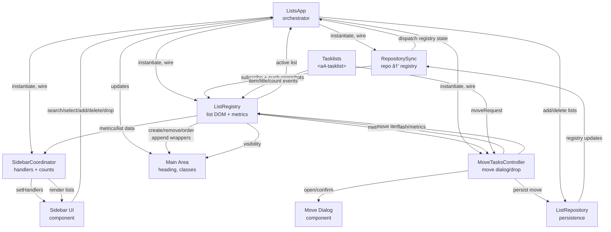

# Mermaid architecture diagram for ListsApp, its controllers, and components

```mermaid
graph TD
  A[ListsApp<br/>orchestrator]
  B[ListRepository<br/>persistence]
  C[RepositorySync<br/>repo → registry]
  D[ListRegistry<br/>list DOM + metrics]
  E[SidebarCoordinator<br/>handlers + counts]
  F[MoveTasksController<br/>move dialog/drop]
  G[Sidebar UI<br/>component]
  H[Move Dialog<br/>component]
  I[Tasklists<br/>&lt;a4-tasklist&gt;]
  J[Main Area<br/>heading, classes]

  A -->|instantiate, wire| C
  A -->|instantiate, wire| D
  A -->|instantiate, wire| E
  A -->|instantiate, wire| F
  A -->|updates| J

  C -->|subscribe + push snapshots| D
  C -->|dispatch registry state| A

  D -->|create/remove/order<br/>append wrappers| J
  D -->|active list| A
  D -->|metrics/list data| E
  D -->|metrics| F
  D -->|visibility| J

  E -->|setHandlers| G
  E -->|render lists| G
  G -->|search/select/add/delete/drop| A

  F -->|open/confirm| H
  F -->|move items| D
  F -->|flash/metrics| D
  F -->|persist move| B

  A -->|add/delete lists| B
  B -->|registry updates| C

  I -->|item/title/count events| D
  I -->|moveRequest| F
```
